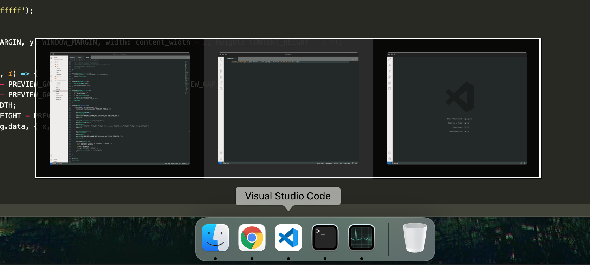

# Dock Window Preview

[](./LICENSE)
[](https://twitter.com/PepsRyuu)

Adds window preview functionality on hover for Mac Dock, an open-source alternative.

*This is very early in development and it will be buggy. Use at your own risk.*



## Motivation

A long-time Windows user here, and I recently had to start using a Macbook, which has been a frustrating experience.
Thankfully, most of my needs as a Windows user are satisfied thanks to AltTab, Rectangle and Karabiner, but I noticed there didn't appear to be any viable option for window previewing on the dock.
The only options seemed to be old paid closed source applications (eg. HyperDock), with no guarantee they were going to work properly at all and didn't seem well supported.
So after a lot of research, I decided to give it a try myself and to give it away for free.

## Getting Started

* Ensure you have NodeJS installed. 
* If Node is not installed, run ```brew install nvm``` then run ```nvm install 14``` and ```nvm use 14```.
* Run ```npm install```, and then ```npm run build```.
* App will be compiled to ```out``` directory.
* Configure ```config.json``` with additional app aliases as required.
* Run the app, grant the requested permissions.

## For developers

* For permissions, grant the same permissions to ```Terminal```.
* Use ```node index.js``` to run.
* Use ```node index.js --debug``` for additional logging information.
* For context, I mostly write front-end applications, so I prefer to work with JavaScript where possible.
* My knowledge of Objective-C is incredibly basic, so the code could be better.
* This approach of mostly JavaScript will make it easier for others to contribute.

## Troubleshooting

* If you rebuild the app, force quit the app using the Activity Monitor, and wipe out the permissions entirely, then run the app again.

## Acknowledgements

* Built on [Yue](https://github.com/yue/yue), bundled using [yackage](https://github.com/yue/yackage).

## Task List

* Filter out Finder windows that cause crashes.
* Show preview for minimized windows.
* Keyboard Controls.
* Make configuration file configurable from menu bar icon, and reload configuration.
* Minimize and close windows from the previews.
* Improve performance of rendering of thumbnails and CPU usage for mouse tracking.
* Custom theming with the config file.
* Once there's a great user experience, investigate how to contribute to brew.
* Support auto-hiding dock and dock in alternate locations.
* Ensure preview does not appear outside of the monitor's area
* If clicking on a dock icon, hide the preview