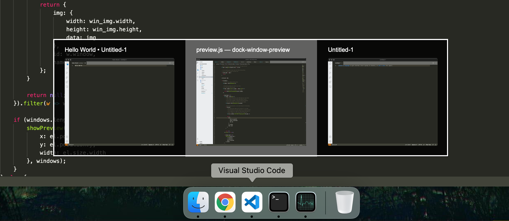

# Dock Window Preview

[](./LICENSE)
[](https://twitter.com/PepsRyuu)

Adds window preview functionality on hover for Mac Dock, an open-source alternative.



## Motivation

A long-time Windows user here, and I recently had to start using a Macbook, which has been a frustrating experience.
Thankfully, most of my needs as a Windows user are satisfied thanks to AltTab, Rectangle and Karabiner, but I noticed there didn't appear to be any viable option for window previewing on the dock.
The only options seemed to be old paid closed source applications (eg. HyperDock), with no guarantee they were going to work properly at all and didn't seem well supported.
So after a lot of research, I decided to give it a try myself and to give it away for free.

## Getting Started (Quick) 

* Run this command in the terminal: ```/bin/bash -c "$(curl -fsSL https://raw.githubusercontent.com/PepsRyuu/dock-window-preview/master/install.sh)"```
* Run the application, grant the permissions.
* Hover over the dock to see window previews.

## Getting Started

* Ensure you have NodeJS installed. 
* If Node is not installed, run ```brew install nvm``` then run ```nvm install 16``` and ```nvm use 16```.
* Clone the repository using ```git clone https://github.com/PepsRyuu/dock-window-preview.git```
* Change into the directory using ```cd dock-window-preview```
* Run ```npm install```, and then ```npm run build```.
* App will be compiled to ```out``` directory.
* Run the app, grant the requested permissions.

## For developers

* For permissions, grant the same permissions to ```Terminal```.
* Use ```npm start``` to run, this will use ```yode``` instead of ```node```.
* For context, I mostly write front-end applications, so I prefer to work with JavaScript where possible.
* My knowledge of Objective-C is incredibly basic, so the code could be better.
* This approach of mostly JavaScript will make it easier for others to contribute.

## Configuration

* Config file is located in ```$HOME/.dock-window-preview/config.json```.
* ```aliases``` allows mapping apps on the dock to their actual name. If a thumbnail isn't showing, see what it's called in the dock, and use Activity Monitor to find it's real name.
* ```theme``` provides customisation to the visual appearance of the preview using hexadecimal colours in the format ```#AARRGGBB```.

## Troubleshooting

* If you rebuild the app, force quit the app using the Activity Monitor, and wipe out the permissions entirely, then run the app again.

## Acknowledgements

* Built on [Yue](https://github.com/yue/yue), bundled using [yackage](https://github.com/yue/yackage).

## Known Limitations

* Only shows windows in the current space / desktop. 
* Compatibility will vary from app to app.

## Task List

* Figure out how to show windows from other spaces and how to focus on them.
* Keyboard Controls.
* Once there's a great user experience, investigate how to contribute to brew.
* Support auto-hiding dock and dock in alternate locations.
* Ensure preview does not appear outside of the monitor's area
* If clicking on a dock icon, hide the preview
* Test further different apps for unusual windows like invisible windows.
* Gather window data asynchronously, and don't show outdated previews if the mouse has moved off that dock icon.
